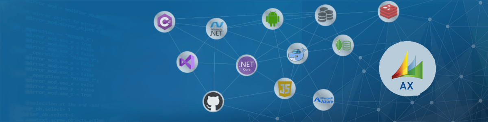

<!DOCTYPE html>
<html lang="en-US">
<head>
    <meta charset="utf-8" />
    <meta name="viewport" content="width=device-width, initial-scale=1.0" />
    <meta name="keywords" content="Maryam Sadeghian,MS Dynamics AX Developer,Portfolio" />
    <meta name="description" content="Maryam Sadeghian's Personal Portfolio" />
    <title>Maryam Sadeghian's Portfolio</title>
    <link href="https://cdn.jsdelivr.net/npm/bootstrap@5.0.2/dist/css/bootstrap.min.css" rel="stylesheet" integrity="sha384-EVSTQN3/azprG1Anm3QDgpJLIm9Nao0Yz1ztcQTwFspd3yD65VohhpuuCOmLASjC" crossorigin="anonymous">
    <link rel="stylesheet" href="site.css" />
    <link rel="stylesheet" href="timeline.css" />
    <link rel="shortcut icon" href="#">
</head>
<body class="text-white" style="background-color:#175582;">
    <header style="height:500px;">
        <nav class="navbar navbar-expand-sm navbar-toggleable-sm navbar-dark">
            

                <a class="navbar-brand" href="/">My Portfolio</a>
                <ul class="navbar-nav flex-grow-1">
                    <li class="nav-item">
                        <a class="nav-link text-light" href="https://msadeghian87.github.io/">
                             My GitHub
                        </a>
                    </li>
                </ul>
            

        </nav>
        

            
            

                
                <h3>Maryam Sadeghian</h3>
                <h5>Microsoft Dynamics AX Developer</h5>
            

        

    </header>
    

        

            <h1>Social Links</h1>
            <ul class="socialLinks">
                <li>
                    <a href="https://www.linkedin.com/in/maryam-sadeghian-0275b541/">
                        
                        LinkedIn
                    </a>
                </li>
                <li>
                    <a href="https://github.com/MSadeghian87">
                        
                        GitHub
                    </a>
                </li>
            </ul>
        

        

            <h1>Skills</h1>
            

                

                    <h4 class="m-3">Programming</h4>
                    <ul class="skills">
                        <li>X++</li>
                        <li>C++</li>
                        <li>.Net Core</li>
                        <li>Java Core</li>
                        <li>MVC</li>
                        <li>SSRS</li>
                        <li>OLAP</li>
                        <li>SSAS</li>
                        <li>JavaScript</li>
                        <li>PowerBI</li>
                        <li>RUP</li>
                        <li>UML</li>
                        <li>Documentation</li>
                        <li>System Administration</li>
                    </ul>
                

                

                    <h4 class="m-3">Team Working</h4>
                    <ul class="skills">
                        <li>VSS</li>
                        <li>TFS</li>
                        <li>Azure DevOps</li>
                        <li>Agile</li>
                        <li>Jira</li>
                        <li>Rational ClearQuest</li>
                    </ul>
                

                

                    <h4 class="m-3">Database</h4>
                    <ul class="skills">
                        <li>SQL</li>
                        <li>Sql Server</li>
                        <li>MySql</li>
                        <li>Oracle</li>
                    </ul>
                

            

        

        

            <h1>Employment</h1>
            <ul class="mt-4 row">
                <li class="col-lg-4 col-md-6">
                    <a href="http://www.gamefacto.com/">Mojdeh co.</a> 
                    2019 - 2020 
                    MS Dynamics AX 2012 Developer & MS PowerBI dashboard designer
                </li>
                <li class="col-lg-4 col-md-6">
                    <a href="https://www.tci.ir/">Atlas Khodro co. (GBG:Golestan business group)</a> 
                    2013 - 2016 
                    MS Dynamics Ax 2009 Developer
                </li>
                <li class="col-lg-4 col-md-6">
                    <a href="https://www.tci.ir/">Iran Fava Gostaresh and Yas Favaye Iranian</a> 
                    2008 - 2012 
                    J2EE Developer
                </li>
                <li class="col-lg-4 col-md-6">
                    <a href="https://www.tci.ir/">IRISA – International Systems Engineering & Automation Company</a> 
                    2006 - 2008 
                    J2EE Developer
                </li>
                <li class="col-lg-4 col-md-6">
                    <a href="https://www.tci.ir/">Behpardaz Jahan</a> 
                    2003 - 2006 
                    J2EE Developer
                </li>
            </ul>
        

        

            <h1>Projects</h1>
            

                

                    

                        

                            <h3>2021</h3>
                            
ERP:MS Dynamics AX 2012

                            
Tosan

                        

                        

                            

                                Deploy and Customization of AR, AP, GL, Procurement and sourcing, Sales and Marketing,Inventory Management Modules of Microsoft Dynamics AX 2012 R3, for Tosan company with a project based contract and a small-scale team.
                            

                            <ul>
                                <li>Role: Dynamics AX Developer</li>
                                <li>Tech Stack: X++, TSQL, Dynamics AX 2012, Sql Server 2016, Visual studio 2013, PowerBI desktop and server.</li>
                            </ul>
                        

                    

                    

                        

                            <h3>2020</h3>
                            
PowerBI Dashboard

                            
Mojdeh

                        

                        

                            

                                Design and publish some analytical and trend dashboards such as Sales, Business efficiency, Tracking the request's flow, Procurement in PowerBI desktop and report server. 
                            

                            <ul>
                                <li>Role: Dashboard Analyzer,Designer and Developer</li>
                                <li>Duration: 6 Months</li>
                                <li>Tech Stack: OLAP, TSQL, SSAS, AX cubes, PowerBI desktop</li>
                            </ul>
                        

                    

                    

                        

                            <h3>2020</h3>
                            
ERP:MS Dynamics AX 2012 R3

                            
Mojdeh

                        

                        

                            

                                Customizing the Transformation management module of AX to cover the need of user in shipment and routing process.In addition, Creating some SSRS reports to AR, AP, GL and IM modules. We also add a middle-scale subsystem to AX for the process of iranian governmental order registration.All it's object was new.
                            

                            <ul>
                                <li>Role: Dynamics AX Developer</li>
                                <li>15 months</li>
                                <li>Tech Stack: Dynamics AX 2012 R3, X++, TSQL, SSRS reports</li>
                            </ul>
                        

                    

                    

                        

                            <h3>2016</h3>
                            
ERP:Dynamics axapta(AX2009)

                            
GBG

                        

                        

                            

                                I was member of a big IT department in GBG holding to deploy and customize the ERP:Dynamics Axapta in all gbg's Subsidiary companies and support it. We could run AR, AP, GL, Im, Human resource, and Fixed asset modules successfully and create some valuable reports that does not exist in the software.
                            

                            <ul>
                                <li>Role: AX Developer</li>
                                <li>Duration: 3 Years and 7 months</li>
                                <li>Tech Stack: X++, Dynamics AXAPTA, TSQL, SSRS reports</li>
                            </ul>
                        

                    

                    

                        

                            <h3>2013</h3>
                            
ERP:SAP

                            
Samin Aria Toos

                        

                        

                            
Business requirment analyzing phaze of SAP ERP implementing in a ditribution company ii order to achieve best practice.

                            <ul>
                                <li>Role: Analyzer</li>
                                <li>Duration: 6 months</li>
                                <li>Tech Stack: SAP docs, Oracle</li>
                            </ul>
                        

                    

                    

                        

                            <h3>2012</h3>
                            
Comprehensive financial system

                            
Tehran University of Medical Sciences and Health Services

                        

                        

                            
A J2ee software to manage financial issues of Tehran University of Medical Sciences and Health Services.

                            <ul>
                                <li>Role: J2EE Developer</li>
                                <li>Duration: 7 months</li>
                                <li>Tech Stack: Java, Struts2, EJB3, Oracle 11g, Eclipse, JasperReport</li>
                            </ul>
                        

                    

                    

                        

                            <h3>2011</h3>
                            
MIS System

                            
Iranian Yas Fava

                        

                        

                            
A J2ee software to generate a comprehensive information and communication technology system of Yas Goods Services Company.

                            <ul>
                                <li>Role: J2EE Developer</li>
                                <li>Duration:4 months</li>
                                <li>Tech Stack: Java, Struts2, EJB3, Oracle 11g, Eclipse, JasperReport</li>
                            </ul>
                        

                    

                    

                        

                            <h3>2011</h3>
                            
IVR System

                            
Iran Fava Gostaresh

                        

                        

                            
An IVR system based on a j2ee application to create an electronic issuance and payment of Water and electricity bills of the Ministry of Energy.

                            <ul>
                                <li>Role: IVR Developer</li>
                                <li>Duration: 1 year and 6 months</li>
                                <li>Tech Stack: Java, Struts2, EJB3, Oracle 11g, Asterisk, Elastix, Linux os.</li>
                            </ul>
                        

                    

                    

                        

                            <h3>2009</h3>
                            
Cost and Tariff system

                            
Iran Fava Gostaresh 

                        

                        

                            
A J2ee software to generate a comprehensive system of cost and tariff determination of infrastructure telecommunication company.

                            <ul>
                                <li>Role: J2EE Developer</li>
                                <li>Duration: 13 months</li>
                                <li>Tech Stack: Java, Struts2, EJB3, Oracle 11g, jbuilder2008, JasperReport</li>
                            </ul>
                        

                    

                    

                        

                            <h3>2008</h3>
                            
J2EE MIS system

                            
Irisa

                        

                        

                            
A Dynamic Master Data system based on Oracle ADF business components and jsf which can be created and defined by users
and Comprehensive information systems of Exir Pharmaceutical Company (production and logistics - finance - business - human resources)

                            <ul>
                                <li>Role: Senior J2EE Developer and Leader</li>
                                <li>Duration: 23 months</li>
                                <li>Tech Stack: Java, JDeveloper 10.1.3, Oracle ADF business components, JSF</li>
                            </ul>
                        

                    

                    

                        

                            <h3>2008</h3>
                            
J2EE Office Automation

                            
Behpardaz Jahan

                        

                        

                            
A j2ee web application for Office Automation System of the Atomic Energy Organization.

                            <ul>
                                <li>Role: J2EE Analyzer,Designer and Developer.</li>
                                <li>Duration: 2 years</li>
                                <li>Tech Stack: Java, Ejb, Struts, RUP, Uml, Oracle 10g</li>
                            </ul>
                        

                    

                

            

        

    

            </body>
</html>
